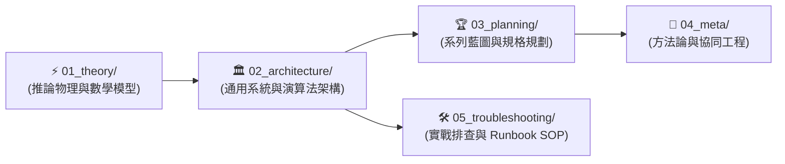

# 🧠 02_wiki: LLM 記憶中樞永久知識庫總導覽 (Wiki Root MOC)

> [!NOTE]
> 歡迎來到 **LLM 記憶中樞 (LLM Memory Hub) 永久知識資產庫**。
> 本庫所有模組與卡片均遵循 **「大腦認知演進順序 (Cognitive Learning Pathway)」** 嚴密編號，各層目錄配備獨立 Index。

---

## 🌲 一、Wiki 模組架構結構樹 (Wiki Module Tree)

```text
docs/02_wiki/
├── 01_theory/            # ⚡ [推論物理] Attention 數學、KV Cache 顯存大小、Prompt Caching 物理時序、雙水位線壓縮
│   ├── 01_Transformer_Prefill_vs_Decode.md
│   ├── 02_KV_Cache_Mechanics.md
│   ├── 03_Prompt_Caching_Lifecycle.md
│   ├── 04_Context_Compaction_and_Summarization.md
│   └── index.md
├── 02_architecture/      # 🏛️ [系統落地] Context 5 維度、LCP 快取演算法、雙層 SQLite 狀態機、雙軌遙測、TUI 盒模型、會話快切、歷史因果圖譜
│   ├── 01_Context_5_Dimensions.md
│   ├── 02_Token_Calculation_and_LCP.md
│   ├── 03_Agent_Storage_and_State_Machine.md
│   ├── 04_Service_Plan_Agent_Observer.md
│   ├── 05_Model_Payload_and_API_Traces.md
│   ├── 06_Dual_Track_Telemetry_and_Window_Accounting.md
│   ├── 07_TUI_Engine_and_Terminal_Layout_Mechanics.md
│   ├── 08_Interactive_Session_Switching_and_Anti_Jitter.md
│   ├── 09_History_Explorer_and_Causality_Graph.md
│   └── index.md
├── 03_planning/          # 🏆 [系列藍圖] v1/ (初版存檔) 與 v2/ (萬能觀測與極致壓縮旗艦版)
│   ├── v1/                   #    📜 [初版存檔] 單一 Agent 原型企劃與初版 30 天大綱
│   ├── v2/                   #    🚀 [旗艦主線] 萬能多 Agent 觀測中樞、AI 基礎課與時代終章 (v2.0)
│   └── index.md              #    🧭 規劃版本演進總導覽 (Planning MOC)
├── 04_meta/              # 🤖 [協同工程] 19 位審查官雙輪對抗審查、Obsidian 拓撲與協同憲法
│   ├── 01_Multi_Agent_Adversarial_Review_Pattern.md
│   ├── 02_Obsidian_Vault_Topology.md
│   └── index.md
├── 05_troubleshooting/   # 🛠️ [實戰手冊] SRE 四段式故障覆盤、QA 問答與 Runbook 診斷 SOP
│   ├── 01_Context_Inflation_and_Intermediate_Compounding.md
│   ├── 02_Startup_Warmup_Double_Ingestion_and_Cache_Lag.md
│   ├── 03_TUI_ANSI_Escape_Truncation_and_Overscroll_Lag.md
│   ├── 04_Filter_Isolation_and_Cache_Expired_Boundary_Leak.md
│   ├── 05_USER_Input_Inbound_Intent_vs_GPU_Cache_Settlement.md
│   ├── 06_Single_Line_Card_Static_Packing_Blank_Gap.md
│   └── index.md
└── index.md              # 🧭 本導覽文件 (Wiki Root MOC)
```

---

## 🏛️ 二、五大知識模組職責與認知階梯 (Module Mandates)

| 模組編號與名稱 | 認知職責與核心範疇 | 前置依賴與解鎖能力 |
| :--- | :--- | :--- |
| **`01_theory/`<br/>推論物理與數學模型** | **【認知起點】** 深入 Transformer 推論的底層硬體物理，建立 GEMM/GEMV、算術強度、KV 顯存占用 ($40GB)、前綴快取生命週期與長上下文雙水位線壓縮的硬核直覺。 | **零前置依賴**。讀完後解鎖「看穿所有 LLM 推論瓶頸、顯存溢出與成本來源」的底層物理直覺。 |
| **`02_architecture/`<br/>通用系統與演算法** | **【系統落地】** 將物理直覺轉化為具體的系統架構。定義 Context 5 維度、LCP 快取比對演算法、雙層 SQLite 狀態機、雙軌遙測引擎、API 載荷協議、全螢幕 TUI 佈局、會話快切與歷史因果圖譜。 | **依賴 `01_theory/`**。讀完後解鎖「設計並實作工業級 Agent 觀測、遙測與記憶服務」的架構能力。 |
| **`03_planning/`<br/>系列藍圖與規劃規格** | **【產品全景】** 從工程師視角躍升至產品架構師。梳理 30 天每日技術交付大綱、Go vs Python 選型決策與 5 階段路線圖。 | **依賴 `01_` 與 `02_`**。讀完後解鎖「規劃並交付完整工程專案」的全局視野。 |
| **`04_meta/`<br/>AI 協同工程與方法論** | **【元架構體系】** 沉澱專案在 19 位 Multi-Agent 雙輪對抗審查、自我進化反饋庫、Obsidian 拓撲與專案協同憲法的最佳實踐。 | **全域通用**。解鎖「構建具備自我進化能力之頂級 AI 協同體系」的組織工程能力。 |
| **`05_troubleshooting/`<br/>實戰故障排查與 Runbook** | **【實戰武器庫】** 收錄長程觀測中遭遇的重大真實 Bug（基線污染、開機雙重分析、ANSI 隱形佔位、快取過濾洩漏、USER 誤標 MISS、單行留白），以四段式 Postmortem 與 Runbook SOP 呈現。 | **依賴 `02_architecture/`**。解鎖「1 分鐘秒級定位並根治底層黑天鵝」的頂級 SRE 實戰能力。 |

---

## 📑 三、認知學習演進卡片矩陣 (Learning Cards Matrix)



### 1. [[02_wiki/01_theory/index|⚡ 01_theory: 推論物理與數學模型]]
* [[01_Transformer_Prefill_vs_Decode]]：推論兩階段之 GEMM 算力密集 vs. GEMV 顯存帶寬密集深度剖析。
* [[02_KV_Cache_Mechanics]]：自回歸 KV Cache 顯存大小數學推導、GQA 演進與 128k OOM 實例計算 ($40GB)。
* [[03_Prompt_Caching_Lifecycle]]：前綴快取生命週期時序轉換、Full Hit vs Partial Hit 稀釋機制、TTL 顯存淘汰與同族變體快取共享。
* [[04_Context_Compaction_and_Summarization]]：雙水位線非同步壓縮管線與「摘要的摘要」$O(1)$ 常數空間收斂數學模型。

### 2. [[02_wiki/02_architecture/index|🏛️ 02_architecture: 通用架構與演算法模式]]
* [[01_Context_5_Dimensions]]：Agent Context 載荷 5 維度模型、對話輪次膨脹趨勢與壓縮戰略。
* [[02_Token_Calculation_and_LCP]]：TikToken (BPE) 分詞與 LCP 最長公共前綴快取演算法 Go 實作。
* [[03_Agent_Storage_and_State_Machine]]：工業級 Agent 雙層 SQLite 7 表結構、六角架構適配器、WAL 直讀與 100KB 滾動切片雙軌日誌。
* [[04_Service_Plan_Agent_Observer]]：`agent-observer` Go 觀測服務 Clean Architecture 系統架構設計書。
* [[05_Model_Payload_and_API_Traces]]：Context 4 大板塊（System, Tools, Trajectory, Active）組裝順序與底層 API 通訊 JSON Schema。
* [[06_Dual_Track_Telemetry_and_Window_Accounting]]：雙軌遙測引擎（Track 1 官方帳單 vs Track 2 本地解剖）、中間步驟非遞增基線與倒推滑動窗口會計演算法。
* [[07_TUI_Engine_and_Terminal_Layout_Mechanics]]：全螢幕 TUI 引擎架構、ANSI 感知狀態機、全寬懸掛縮排、零過度滾動與嵌入式多語言 Markdown。
* [[08_Interactive_Session_Switching_and_Anti_Jitter]]：全域會話快切中樞（`Ctrl+p`）、動態目錄發現與歷史步驟防抖動鎖定機制（Anti-Jitter Lock）。
* [[09_History_Explorer_and_Causality_Graph]]：歷史步進瀏覽器、雙軌正交過濾引擎（`[T:Type]` 與 `[C:Cache]`）、方案 B 緊湊括號封裝與雙向因果跳轉（`p`/`c`/`C`）。

### 3. [[02_wiki/03_planning/index|🏆 03_planning: 系列藍圖與規格規劃]]
* [[03_planning/v2/index|🚀 v2/ 旗艦版企劃與 30 天大綱 (當前主線)]]：萬能多 Agent 觀測中樞、開篇與終章「共舞」自白與極致壓縮。
  * [[03_planning/v2/01_Master_Plan|01_Master_Plan (v2.0)]]、[[03_planning/v2/02_30_Days_Breakdown|02_30_Days_Breakdown (v2.0)]]、[[03_planning/v2/03_Tech_Stack_Tradeoffs|03_Tech_Stack_Tradeoffs (v2.0)]]、[[03_planning/v2/04_Phased_Implementation_Roadmap|04_Phased_Implementation_Roadmap (v2.0)]]
* [[03_planning/v1/index|📜 v1/ 初版企劃與大綱存檔 (歷史存檔)]]：單一 Agent CLI 觀測原型與初版 30 天大綱。
  * [[03_planning/v1/01_Master_Plan|01_Master_Plan (v1.0)]]、[[03_planning/v1/02_30_Days_Breakdown|02_30_Days_Breakdown (v1.0)]]、[[03_planning/v1/03_Tech_Stack_Tradeoffs|03_Tech_Stack_Tradeoffs (v1.0)]]、[[03_planning/v1/04_Phased_Implementation_Roadmap|04_Phased_Implementation_Roadmap (v1.0)]]

### 4. [[02_wiki/04_meta/index|🤖 04_meta: AI 協同工程與知識庫方法論]]
* [[01_Multi_Agent_Adversarial_Review_Pattern]]：19 位世界前 1% 審查矩陣、雙輪對抗審查、Main Agent 批判性過濾與自我進化閉環。
* [[02_Obsidian_Vault_Topology]]：全域檔案結構樹、High-Level 目錄職責對照表、Wiki 終點論、三權分立拓撲、.obsidian 嚴格 Git 白名單與 AGENTS.md 協同憲法。

### 5. [[02_wiki/05_troubleshooting/index|🛠️ 05_troubleshooting: 實戰故障排查與 Runbook 手冊]]
* [[01_Context_Inflation_and_Intermediate_Compounding|01. 89 萬字膨脹與基線污染]]：中間步驟非遞增基線修復與 256k 物理窗口約束。
* [[02_Startup_Warmup_Double_Ingestion_and_Cache_Lag|02. 開機預熱雙重分析與歷史遙測誤用]]：單一攝入責任鏈與開機 700+ 世代紀錄預載入。
* [[03_TUI_ANSI_Escape_Truncation_and_Overscroll_Lag|03. ANSI 字元隱形佔位與滾動卡頓]]：ANSI 感知狀態機、29 格懸掛縮排與 `getDocsMaxScroll` 邊界約束。
* [[04_Filter_Isolation_and_Cache_Expired_Boundary_Leak|04. EXPIRED 洩漏至 MISS 篩選漏洞]]：顯式互斥排除守衛與快取狀態嚴格正交隔離。
* [[05_USER_Input_Inbound_Intent_vs_GPU_Cache_Settlement|05. USER 誤標 MISS 與結算錯位]]：使用者意圖與雲端推論時序解耦，移除合成標籤。
* [[06_Single_Line_Card_Static_Packing_Blank_Gap|06. 單行卡片靜態除二清單大片留白]]：動態行數打包演算法修復與多高度緊湊排版。

---

## 🧭 導航
* 🔙 回到頂層：[[index|知識庫頂層總導航]]
