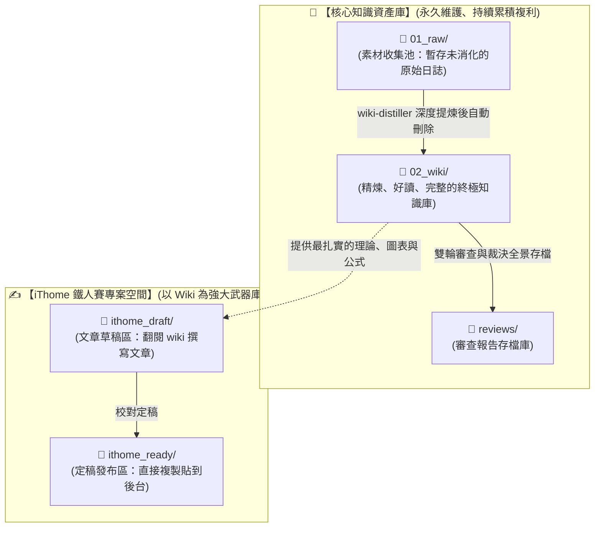

# 📐 LLM Wiki 架構憲法與維護協定 (Schema & Protocol)

> [!IMPORTANT]
> **🌟 根本核心原則：Wiki 是終點，不是中間站！**
> `02_wiki/` 是經過二次極致精煉、對人類極度好讀、好學習、邏輯自洽且高度互連的 **「長效知識中樞（Permanent Knowledge Engine）」**。每篇 Wiki 卡片都必須是最高品質的完整技術筆記。
> `ithome_draft/` 與 `ithome_ready/` 只是為了這次參加 2026 iThome 鐵人賽而設立的 **「獨立輸出專案（Publishing Project）」**，兩者完全解耦！

---

## 🏛️ 目錄關係與邊界定義 (Folder Boundaries)

---

## 🔍 核心四大維護鐵律 (Core Protocols)

1. **🗑️ Raw 素材消化即刪除 (Digest & Delete)**：
   * `01_raw/` 僅作為臨時未處理素材池。一旦素材被 100% 提煉、核實並整合進 `02_wiki/`，**該 Raw 檔案必須立即刪除**，絕不留存冗餘過渡檔案。
2. **📜 強制輸出審查報告 (Mandatory Audit Reports)**：
   * 每次執行雙輪審查後，必須在 `docs/reviews/` 生成包含每位審查官完整思維鏈、具體意見、Main Agent 駁回理由與大檢察官簽核的全景報告。
3. **🔍 代碼真相第一基準 (Codebase as Source of Truth)**：
   * 提煉與修訂 Wiki 時，必須直接 Trace 專案源碼（`agent-observer/internal/`），確保結構體、函式介面與演算法邏輯 100% 吻合。
4. **🧠 大腦認知編號 (Cognitive Learning Sequence)**：
   * 編號嚴格對齊「人類認知演進順序」，讀完 `01` 自然解鎖 `02`。
